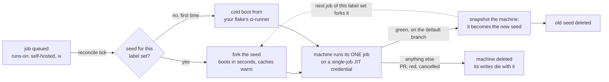

# ix-runners

Ephemeral fork-per-job GitHub Actions runners on [ix](https://ix.dev) VMs.

Every runner is a machine that exists for exactly one job. When a job on
your default branch goes green, the machine that ran it is snapshotted and
becomes the **seed** for its label set: every later job with those labels
boots a fork of it in seconds - toolchains, `target/`, `node_modules`,
every cache already warm - runs, and is deleted. Warm caches without shared
machines: a PR job's writes die with its fork and can never reach another
job or the seed.

Why it looks this way: [docs/design.md](./docs/design.md).

## The machine lifecycle, in one picture



Two things fall out of the shape. Warmth is a property of the **label
set**, not of any machine - so there is no idle pool, no cold-start tax
after the first green run, and nothing to repair. And isolation is the
machine boundary - a PR job runs on a fork that is deleted afterward, so
nothing it writes can ever reach another job or the seed.

## Setup

1. Add two Actions secrets: `IX_TOKEN` (the ix account the VMs bill to) and
   `RUNNER_PAT` (fine-grained PAT, Administration read/write on the repo).

   The built-in `GITHUB_TOKEN` cannot stand in for the PAT: workflow
   permissions have no `administration` scope, so it structurally cannot
   mint runner credentials.

2. Wire the runner template into your `flake.nix`:

   ```nix
   inputs.nixpkgs-ci.url = "github:NixOS/nixpkgs/nixos-unstable";
   inputs.ix-runners.url = "github:indexable-inc/ix-runners/<rev>";

   # in outputs:
   nixosConfigurations.ci-runner = ix-runners.lib.mkRunner {
     nixpkgs = nixpkgs-ci;                # keep it fresh: GitHub deprecates
     modules = [ ./nix/ci-runner.nix ];   # old runner versions aggressively
   };
   ```

3. Write your policy in `nix/ci-runner.nix`: the packages your jobs expect
   on PATH and any job environment.

   ```nix
   { pkgs, ... }:
   {
     services.ix-runner.extraPackages = [ pkgs.docker pkgs.protobuf ];
   }
   ```

4. Optionally add `.github/ix-runners.toml`. Every key has a working
   default; the file exists for the dials:

   ```toml
   region = "us-west-1"
   max-runners = 16        # global cap on concurrently existing machines
   headroom = 1            # idle standbys beyond queued demand, per lineage
   min-warm = 0            # standbys per known lineage even with no demand
   idle-grace-seconds = 900
   ```

5. Add the workflow below, merge, and put `runs-on: [self-hosted, ix]` in
   the workflows you want on the fleet. The `ix` marker label is what opts
   a job in; every distinct label set you use becomes its own seed lineage.

### The workflow

```yaml
name: ix runners

on:
  schedule:
    # The steady tick: promotion, retirement, cleanup. Best effort - GitHub
    # drops scheduled runs under load, and a missed tick costs latency,
    # never correctness.
    - cron: "*/15 * * * *"
  workflow_dispatch:
  workflow_run:
    # The fast path: fires when any run is requested, so capacity is being
    # created while the wave's jobs are still queueing. "**" includes this
    # workflow itself (workflow_run cannot exclude by name); the follow-up
    # it requests coalesces into the concurrency group below and GitHub
    # caps the chain, so the noise is one extra no-op tick, not a loop.
    workflows: ["**"]
    types: [requested]

permissions:
  contents: read
  actions: read

# One reconcile at a time, never cancelled mid-create: a cancelled run can
# leave a machine created but not yet registered.
concurrency:
  group: ix-runners
  cancel-in-progress: false

jobs:
  reconcile:
    # GITHUB-HOSTED only. A runner VM must never see IX_TOKEN or RUNNER_PAT.
    runs-on: ubuntu-latest
    steps:
      # Pinned by commit, not by tag: this job holds IX_TOKEN and a
      # repo-admin PAT, and checkout runs before the reconcile does - it
      # can rewrite the environment the reconcile then reads, through
      # $GITHUB_ENV.
      - uses: actions/checkout@3d3c42e5aac5ba805825da76410c181273ba90b1 # v7
        with:
          # The runner-config rev is the last commit touching nix/ (or your
          # flake-dir), so the history has to be here. Under a shallow
          # checkout every commit looks like a config change and the fleet
          # would roll on every push; the reconcile detects this and refuses.
          fetch-depth: 0
          persist-credentials: false

      - uses: indexable-inc/ix-runners@<rev>
        with:
          ix-token: ${{ secrets.IX_TOKEN }}
          runner-pat: ${{ secrets.RUNNER_PAT }}
```

### Pool mode: pools shipped in this repository

A pool ix maintains for you lives under [`pools/`](./pools) in this repo -
spec (`ix-runners.toml`), runner policy, and template flake - and your
repository carries only the workflow. Pass `pool: <name>` instead of
`config-file`:

```yaml
      - uses: indexable-inc/ix-runners@<sha>   # full commit sha, required
        with:
          ix-token: ${{ secrets.IX_TOKEN }}
          runner-pat: ${{ secrets.RUNNER_PAT }}
          pool: baml
```

In pool mode the cold-boot template pins THIS repository at the action's
own commit, and seeds key on that same rev - so bumping the `uses:` sha is
what re-seeds the fleet (the ordinary config-change law, with the pin as
the config), and a merge in your repository never can. The reconcile reads
nothing from your working tree: drop the checkout step (and with it the
`fetch-depth: 0` requirement) from the workflow above, and the `push`
trigger stops mattering - `schedule`, `workflow_dispatch` and
`workflow_run` are enough.

## How it works

Warmth is copy-on-write. A lineage's *seed* is an immutable ix snapshot
(disk and memory) of the machine that ran its last green default-branch
job. Every runner is a fork of that snapshot: it boots in about a second
with everything the green run left behind - the nix store, `$HOME`
caches, compiled artifacts - already on disk, and its writes land in its
own private copy-on-write layer. Nothing a job writes can reach the seed
or any sibling fork; a fork's writes die with the fork. The seed only
ever advances by *promotion*: a fresh snapshot of a machine that just
ran a green default-branch job. That is the whole trick - `ubuntu-latest`
spends minutes re-downloading what your last run already built, a fork
starts where the last green run stopped.

Each tick is level-based and stateless: it observes the machines, the
runner registrations and the job queue fresh, decides from that snapshot
alone, and converges. Every machine's role rides its NAME
(`<pool>-run-<lineage>-<nonce>`, `<pool>-seed-<lineage>-<rev>`), so there
is no state store to disagree with reality.

- Demanded job: a machine is spawned for it (plus `headroom`) - forked
  from its lineage's seed, or booted cold from your flake when the lineage
  has none yet. Each machine gets its own single-job JIT credential,
  minted for it by name and written to it alone.
- Green default-branch job: the machine that ran it is snapshotted and
  swapped in as its lineage's seed before being stopped. Only
  default-branch successes promote - PR state never enters a seed.
- Finished runner (its one-job registration is gone): deleted.
- Config change under `nix/`/`flake.nix`/`flake.lock` (or your
  `flake-dir`): every seed of the old rev reads as absent and is deleted;
  each lineage re-seeds from its next green run on the new template.
- Idle standby past `idle-grace-seconds`: deregistered and deleted -
  GitHub refuses (422) to deregister a runner that is mid-job, and that
  refusal is the one lock in the system.
- A tick that could not read the queue makes no scale-down decision at
  all, and an event tick only ever adds capacity.

Failures are per step: one machine's failure is logged as an Actions
error and the run continues; the job summary carries a table of what
happened.

## Security model

- `IX_TOKEN` and `RUNNER_PAT` live in Actions secrets and never reach a
  runner VM. The reconcile refuses to start unless `RUNNER_ENVIRONMENT`
  says it is on a GitHub-hosted runner: it is the control plane, so
  running it on the fleet would hand both secrets to the machines they
  exist to control. On GHES or ARC, set `IX_RUNNERS_ALLOW_NON_HOSTED=1`
  to accept that explicitly - which also lets `GITHUB_API_URL` name your
  own https API base. Everywhere else the API base is pinned to
  `api.github.com`, because `GITHUB_API_URL` is an environment variable
  any earlier step in the job can rewrite.
- No credentialed request follows a redirect: a 30x would re-aim the
  Authorization header at whatever host `Location` names.
- The only credential a runner VM ever holds is its own single-job JIT
  config, which can take exactly one job as exactly the runner it names,
  and is consumed (moved out of the watched path) before the job starts -
  so a spent credential can never ride into a seed snapshot. It is masked
  in Actions logs the moment it is minted.
- An expired or revoked `RUNNER_PAT` presents as HTTP 401; the reconcile
  stops and says exactly that.
- Jobs run with the machine as the isolation boundary: no co-tenants, no
  shared caches, nothing to escape into. A PR job can poison at most its
  own fork, which is deleted. Still: seeds descend only from default-branch
  runs, so gate who can push there as you already do.
- Everything that runs your CI is in this repository, readable.

## What differs from ubuntu-latest

The runner VM is NixOS, tuned for parity where it is cheap and honest
where it is not:

- Foreign dynamically linked binaries (rustup/mise toolchains, prebuilt
  node, playwright browsers) run via nix-ld + envfs with a generous
  library set; a missing library fails at load time - file an issue,
  additions are one line.
- No sudo: the job user cannot elevate. Install into `$HOME` or ship the
  package in your nix policy instead.
- `$HOME` (/home/runner) is the warmth: whatever a green default-branch
  run leaves there is what the next fork of that lineage boots with
  (copy-on-write, so ten concurrent forks share the seed's bytes and
  none can dirty another).
- Preinstalled tooling comes from your nix policy, not from a hosted
  image: anything a job expects "to just be there" (Go, docker, protoc)
  must be listed there.
- `token-source: ix` deletes the PAT entirely: the reconcile trades its
  OIDC identity (`permissions: id-token: write`) for a repo-scoped App
  installation token minted by ix. The repository comes from the OIDC
  token's signed claims, so the credential cannot be minted for a repo
  the run has not proved it is running for.

## Roadmap

- An ix-hosted control plane (GitHub App webhooks instead of a workflow in
  your repo): the workflow file deletes, the policy file stays.
